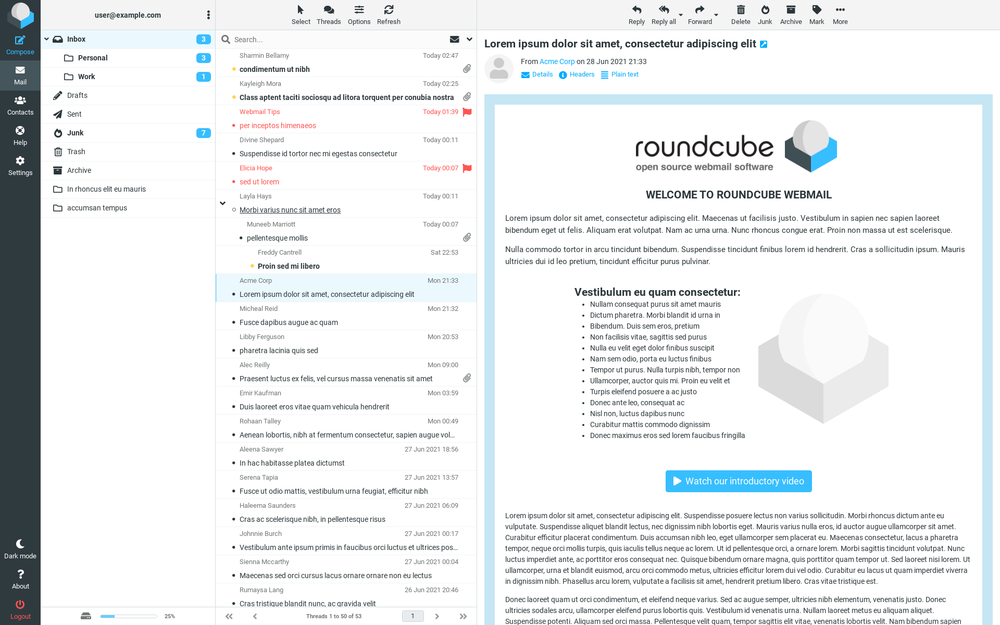

<!--
N.B.: This README was automatically generated by https://github.com/YunoHost/apps/tree/master/tools/README-generator
It shall NOT be edited by hand.
-->

# Roundcube pour YunoHost

[](https://dash.yunohost.org/appci/app/roundcube)  

[](https://install-app.yunohost.org/?app=roundcube)

*[Read this readme in english.](./README.md)*

> *Ce package vous permet d’installer Roundcube rapidement et simplement sur un serveur YunoHost.
Si vous n’avez pas YunoHost, regardez [ici](https://yunohost.org/#/install) pour savoir comment l’installer et en profiter.*

## Vue d’ensemble

Roundcube est un client IMAP multilingue basé sur un navigateur avec une interface utilisateur semblable à une application.

## Caractéristiques spécifiques YunoHost

En plus des fonctionnalités principales de Roundcube, les éléments suivants sont disponibles avec ce paquet :

 * Synchronisez vos alias de messagerie en tant qu'identités dans Roundcube.
 * Installation des plugins [contextmenu](https://packagist.org/packages/johndoh/contextmenu)
   et [automatic addressbook](https://packagist.org/packages/projectmyst/automatic_addressbook) par default.
 * Permettre d'installer [CardDAV](https://packagist.org/packages/roundcube/carddav) (carnet d'adresses) de synchronisation à l'installation - notez que si vous avez installé Nextcloud ou Baïkal, il ajoutera automatiquement le carnet d'adresses correspondant.
* Prise en charge du chiffrement PGP avec le plugin Enigma installé par default.


**Version incluse :** 1.6.2~ynh1

**Démo :** https://demo.yunohost.org/webmail/

## Captures d’écran



## Documentations et ressources

* Site officiel de l’app : <https://roundcube.net/>
* Documentation officielle de l’admin : <https://github.com/roundcube/roundcubemail/wiki>
* Dépôt de code officiel de l’app : <https://github.com/roundcube/roundcubemail>
* Documentation YunoHost pour cette app : <https://yunohost.org/app_roundcube>
* Signaler un bug : <https://github.com/YunoHost-Apps/roundcube_ynh/issues>

## Informations pour les développeurs

Merci de faire vos pull request sur la [branche testing](https://github.com/YunoHost-Apps/roundcube_ynh/tree/testing).

Pour essayer la branche testing, procédez comme suit.

``` bash
sudo yunohost app install https://github.com/YunoHost-Apps/roundcube_ynh/tree/testing --debug
ou
sudo yunohost app upgrade roundcube -u https://github.com/YunoHost-Apps/roundcube_ynh/tree/testing --debug
```

**Plus d’infos sur le packaging d’applications :** <https://yunohost.org/packaging_apps>